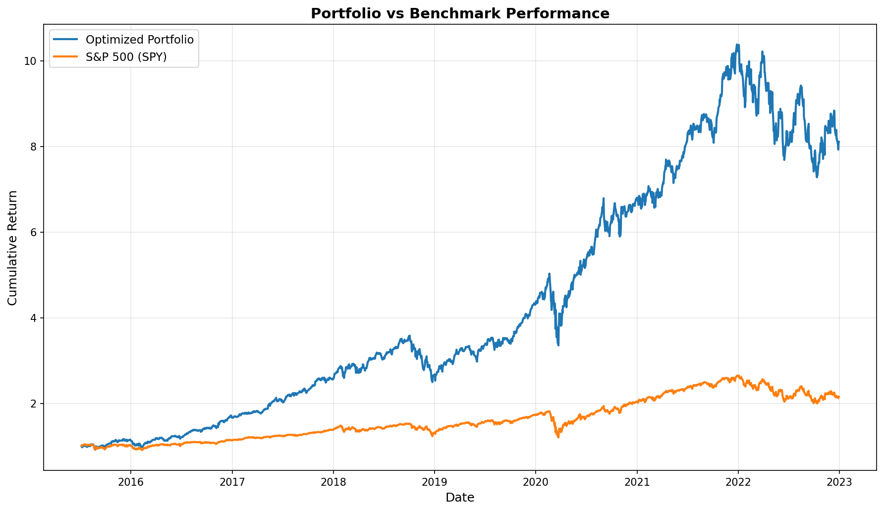
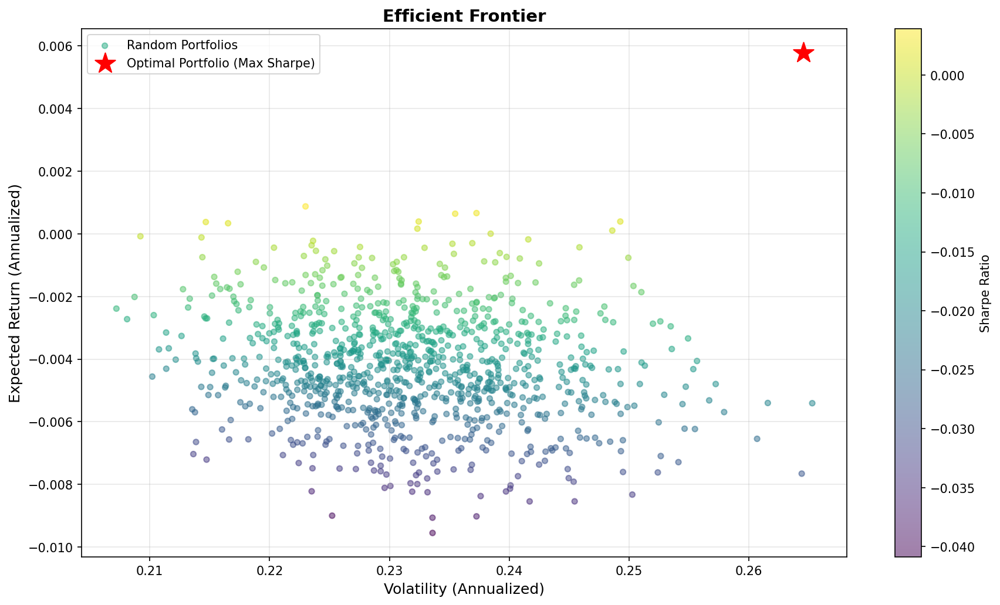
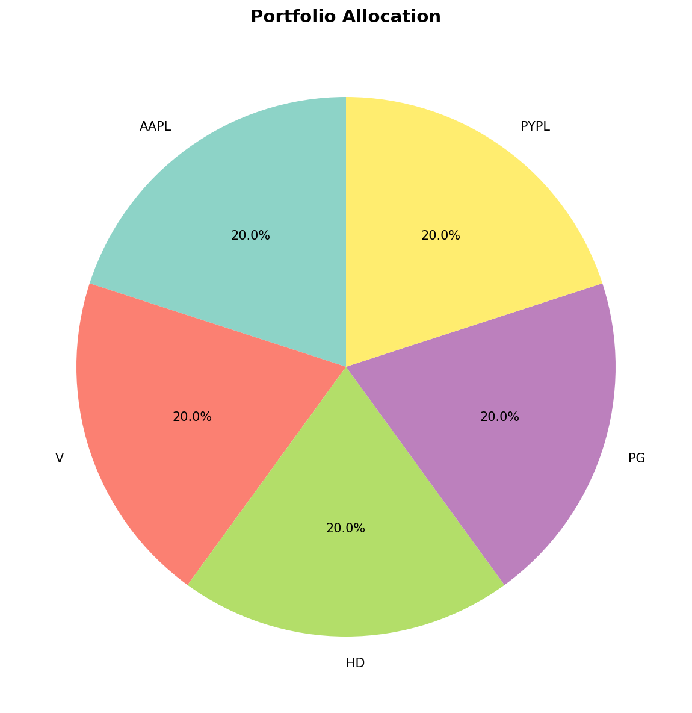

📊 Multi-Factor Portfolio Optimization Framework

A systematic equity portfolio construction framework combining asset pricing theory (Fama-French 5 factors) with mean-variance optimization to build a maximum Sharpe ratio portfolio.

🚀 Key Features
📥 Automated data pipeline (yfinance + Fama-French factors)
🧠 Factor-based expected return estimation (OLS regression)
📊 Risk modeling via covariance matrix (annualized)
⚙️ Constrained portfolio optimization (SLSQP)
📈 Backtesting vs benchmark (S&P 500 - SPY)
🎯 Efficient frontier simulation & visualization
🧠 Methodology
Expected Returns (Factor Model)
Estimates returns using Fama-French 5-factor regression

For each asset:

Ri​=α+β1​(Mkt−RF)+β2​SMB+β3​HML+β4​RMW+β5​CMA
Monthly predictions → annualized expected returns
Portfolio Optimization

Maximize Sharpe Ratio:

 (portfolio return − risk-free rate) / portfolio volatility
 Subject to:

Fully invested: ∑w=1
Long-only constraint
Max position size = 20% per asset
Backtesting
Applies optimal weights to historical returns (2015–2023)
Benchmarked against SPY
Evaluates cumulative performance
📈 Results
Portfolio vs Benchmark
Optimized portfolio significantly outperforms SPY over the sample period
Higher return profile with increased volatility
Efficient Frontier
Monte Carlo simulation of random portfolios
Optimal portfolio selected via maximum Sharpe ratio
## 📊 Results

### Portfolio vs Benchmark

### Efficient Frontier

### Portfolio Allocation

⚙️ Installation
git clone https://github.com/abdulmoiz23278-ctrl/Factor-Optimizer.git
cd multi-factor-portfolio
pip install -r requirements.txt

▶️ Usage

Run from root directory:

python main.py
📌 Limitations
In-sample optimization (no out-of-sample testing)
No transaction costs
No rebalancing strategy
Covariance matrix not regularized

🔮 Future Improvements
Rolling backtesting (walk-forward)
Transaction costs & turnover constraints
Covariance shrinkage (Ledoit-Wolf)
Alternative signals (momentum, ML models)

📚 Tech Stack
Python
NumPy / Pandas
SciPy (optimization)
Statsmodels (regression)
Matplotlib (visualization)
yfinance

⚠️ Disclaimer

This project is for educational purposes only.

	​

	​
