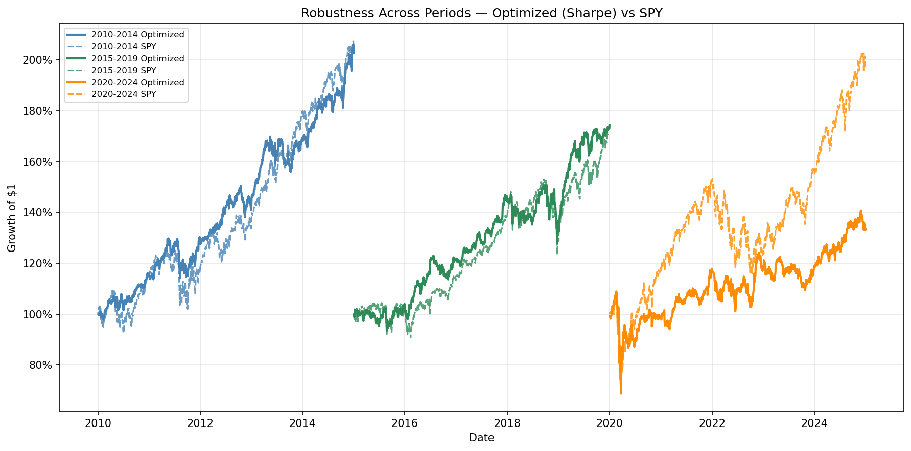

# Factor-Optimizer

Walk-forward multi-factor portfolio optimizer validated across three independent out-of-sample regimes (2010–2014, 2015–2019, 2020–2024). Long-only Fama-French 5 + Carhart UMD with mean-variance and CVaR objectives, statistical inference via deflated Sharpe and paired block-bootstrap, on a survivorship-bias-free S&P 500 constituent universe.


---

## Headline result

Three non-overlapping five-year OOS windows, independent training data. Both Sharpe-maximizing and CVaR objectives run per window:

| Period | Objective | Sharpe | DSR | Annual Return | Max DD | Calmar | Δ Sharpe vs SPY (95% CI) | SPY Sharpe |
| --- | --- | --- | --- | --- | --- | --- | --- | --- |
| 2010–2014 | Sharpe | 1.32 | 0.890 | 19.0% | -17.2% | 1.11 | [-0.05, 0.80] | 0.98 |
| 2010–2014 | CVaR | 1.45 | 0.934 | 19.7% | -14.4% | 1.37 | [0.03, 0.91] | 0.98 |
| 2015–2019 | Sharpe | 0.94 | 0.718 | 13.1% | -10.9% | 1.20 | [-0.51, 0.67] | 0.81 |
| 2015–2019 | CVaR | 0.85 | 0.650 | 10.9% | -12.3% | 0.89 | [-0.57, 0.58] | 0.81 |
| 2020–2024 | Sharpe | 0.16 | 0.144 | 3.5% | -38.6% | 0.09 | [-0.98, -0.02] | 0.64 |
| 2020–2024 | CVaR | 0.42 | 0.316 | 9.1% | -33.3% | 0.27 | [-0.77, 0.31] | 0.64 |



| Objective | Mean Sharpe | Std | Min | Periods Sharpe > 0 |
| --- | --- | --- | --- | --- |
| Sharpe | 0.81 | 0.48 | 0.16 | 3/3 |
| CVaR | 0.91 | 0.42 | 0.42 | 3/3 |

The CVaR objective is the stronger of the two on average (mean Sharpe 0.91 vs 0.81) and is the only configuration with a statistically significant Sharpe edge over SPY in any window: in 2010–2014 the paired block-bootstrap CI for its Sharpe difference vs SPY is [0.03, 0.91], which excludes zero. That edge does not persist — the CVaR difference CI includes zero in both 2015–2019 and 2020–2024 — so it should be read as regime-dependent, not as a robust structural advantage.

The Sharpe objective beats SPY on point estimate in 2010–2014 (1.32 vs 0.98) and 2015–2019 (0.94 vs 0.81), but both paired CIs include zero, so those gaps are not statistically significant. In 2020–2024 the Sharpe objective significantly underperforms SPY (0.16 vs 0.64; CI [-0.98, -0.02] excludes zero). CVaR also trails SPY in that window but not significantly (CI [-0.77, 0.31] includes zero).

Deflated Sharpe tracks strategy quality across windows (0.144 to 0.934); the weak 2020–2024 Sharpe run correctly scores 0.144. The 2020–2024 underperformance is consistent with weakening of the low-volatility factor in a regime where index returns concentrated in mega-cap growth (Blitz, van Vliet, & Baltussen, 2019). No parameter tuning was performed between periods.

---

## What this demonstrates

Rigorous walk-forward portfolio construction with:

- **Survivorship-bias-free universe.** Point-in-time S&P 500 membership at each rebalance. Delistings handled explicitly.
- **No factor lookahead.** Fama-French factors filtered to those published as of each rebalance date.
- **CVaR as a linear program.** Rockafellar-Uryasev formulation solved globally via `scipy.linprog` HiGHS.
- **Deflated Sharpe.** Multiple-testing correction applied (Bailey & López de Prado, 2014).
- **Paired bootstrap vs benchmark.** 95% CIs for Sharpe-difference vs SPY in each window.
- **Multi-period validation.** Three independent OOS windows, with aggregate cross-period statistics.

---

## Methodology

**Universe.** S&P 500 historical constituents (898 union tickers, 659 with usable price history, 4,529 trading days, 2007–2025), top 50 by data coverage at each quarterly rebalance.

**Expected returns.** Fama-French 5 + Carhart UMD. HAC-robust OLS on rolling 24-month windows. Long-run factor premia from Ken French data. In-sample alpha excluded (does not persist OOS; McLean & Pontiff, 2016).

**Covariance.** Ledoit-Wolf shrinkage on 36-month daily returns.

**Optimization.** Two objectives run independently:
- Mean-variance: SLSQP on negative Sharpe with sum-to-one, 0 ≤ w_i ≤ 0.20.
- CVaR: `scipy.linprog` HiGHS, 5% tail, 8% target return, sum-to-one, box and turnover constraints.

**Rebalancing.** Quarterly. 10 bps transaction cost on drifted-weight turnover.

**Inference.** Deflated Sharpe (n_trials = 12). Block-bootstrap (block size 21, 1000 samples) for standalone and paired-vs-SPY Sharpe CIs.

---

## Repository structure

```
Factor-Optimizer/
├── src/
│   ├── data_fetcher.py        # yfinance with delisting-aware return handling
│   ├── universe.py            # Point-in-time S&P 500 constituent loader
│   ├── factor_model.py        # FF5 + UMD regression, expected returns, attribution
│   ├── factor_optimizer.py    # Sharpe (SLSQP) and CVaR (HiGHS LP) optimizers
│   └── statistics.py          # Deflated Sharpe, paired bootstrap
├── tests/
│   ├── test_invariants.py     # Weight caps, sum-to-one, universe rotation
│   └── test_attribution.py    # Factor decomposition balance check
├── data/
│   └── sp500_history.csv      # Historical constituent membership
├── main.py
└── requirements.txt
```

---

## Quick start

```bash
git clone https://github.com/abdulmoiz23278-ctrl/Factor-Optimizer.git
cd Factor-Optimizer
pip install -r requirements.txt
python main.py
pytest tests/ -v
```

Runtime ~15–20 minutes (six walk-forward backtests, FF + UMD factor downloads cached after first run). Outputs: robustness table to stdout, plot to `robustness_periods.png`, state pickled to `tests/_robustness_state.pkl`.

---

## Limitations

- **Price data.** yfinance is not point-in-time; CRSP would be the production replacement.
- **Factor exposures.** Static within each 24-month rolling window.
- **Universe.** Top 50 by liquidity within S&P 500. Production strategies use 500–3000 names.
- **Execution.** Linear 10 bps cost; production would require square-root market impact with ADV-based sizing.
- **Long-only.** Market-neutral and 130/30 variants are natural extensions.

---

## References

1. Fama, E. F., & French, K. R. (2015). A five-factor asset pricing model. *Journal of Financial Economics*, 116(1), 1–22.
2. Carhart, M. M. (1997). On persistence in mutual fund performance. *Journal of Finance*, 52(1), 57–82.
3. Rockafellar, R. T., & Uryasev, S. (2000). Optimization of conditional value-at-risk. *Journal of Risk*, 2(3), 21–41.
4. Bailey, D. H., & López de Prado, M. (2014). The deflated Sharpe ratio: Correcting for selection bias, backtest overfitting, and non-normality. *Journal of Portfolio Management*, 40(5), 94–107.
5. Blitz, D., van Vliet, P., & Baltussen, G. (2019). The volatility effect revisited. *Journal of Portfolio Management*, 46(2).
6. McLean, R. D., & Pontiff, J. (2016). Does academic research destroy stock return predictability? *Journal of Finance*, 71(1), 5–32.

---

*Python, scipy, statsmodels, pandas, yfinance.*
