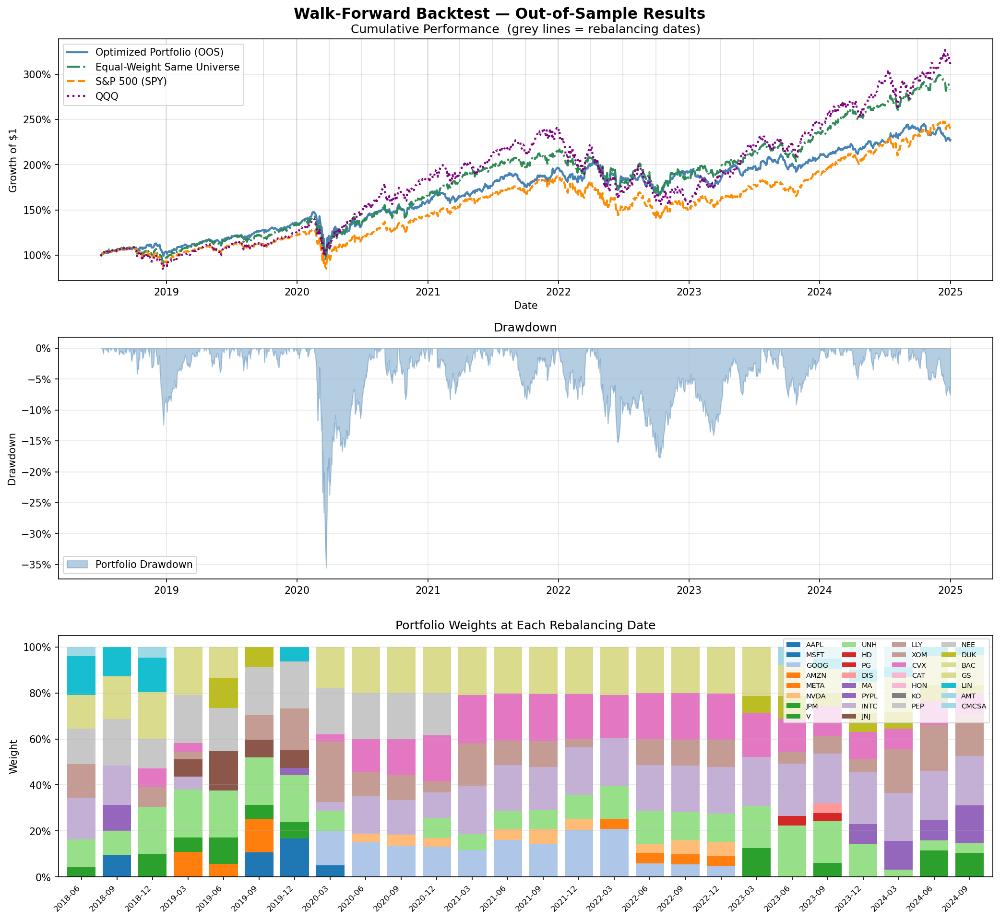

# Factor-Optimizer

[](https://www.python.org/)
[](LICENSE)

Walk-forward portfolio optimizer that uses Fama–French factors to forecast returns, rebalance quarterly under risk constraints, and benchmark against equal-weight, SPY, and QQQ.



## Results (out-of-sample)

**Period:** Jul 2018 – Dec 2024 · **30 large-cap stocks** · **26 quarterly rebalances**  
CVaR objective, 75% return shrinkage, 3% min position size, 10 bps transaction costs

| | Optimized | Equal-weight | SPY | QQQ |
|---|--:|--:|--:|--:|
| Total return | 127% | 184% | 140% | 211% |
| Annual return | 13.5% | 17.5% | 14.4% | 19.1% |
| Sharpe | 0.63 | 0.77 | 0.63 | 0.70 |
| Annual volatility | 18.4% | 20.0% | 19.7% | 24.4% |
| Max drawdown | −35.5% | −33.3% | −33.7% | −35.1% |

The optimizer targets tail-risk control — it achieves the lowest volatility (18.4%) of any portfolio in the comparison, including SPY.

## How it works

1. **Download** daily prices for 30 stocks across all 11 GICS sectors (yfinance) and Fama–French factor history (Ken French).
2. **Train** on a rolling 36-month window — no future data is used when picking weights.
3. **Estimate** each stock’s expected return from its factor exposures (market, size, value, profitability, investment), with returns shrunk toward the universe average to reduce overfitting.
4. **Optimize** portfolio weights to control tail risk (CVaR) with a 20% cap per stock and optional covariance shrinkage (Ledoit–Wolf).
5. **Trade** the next quarter out-of-sample, charge turnover costs on rebalance days, and drop positions below 3%.
6. **Compare** to equal-weight same stocks, SPY, and QQQ on the identical calendar.

A 2-state HMM on market returns can detect high-volatility regimes and reduce per-stock position limits by 30% until conditions normalize (`use_regime=True`).

Optional add-ons (off by default): momentum factor, Sharpe objective, turnover caps, HMM regime scaling, and return attribution.

## Quick start

```bash
pip install -r requirements.txt
python main.py
```

Outputs: metrics table in the terminal, `walk_forward_results.png`, and the latest holdings printout.

## Stack

Python · pandas · NumPy · SciPy · statsmodels · scikit-learn · yfinance · matplotlib

## Limitations

Fixed ticker list (survivorship bias), simplified transaction costs, monthly factor timing, and research-only — not live trading advice. Past OOS results depend on data revisions and config in `main.py`.

## License

See [LICENSE](LICENSE).
